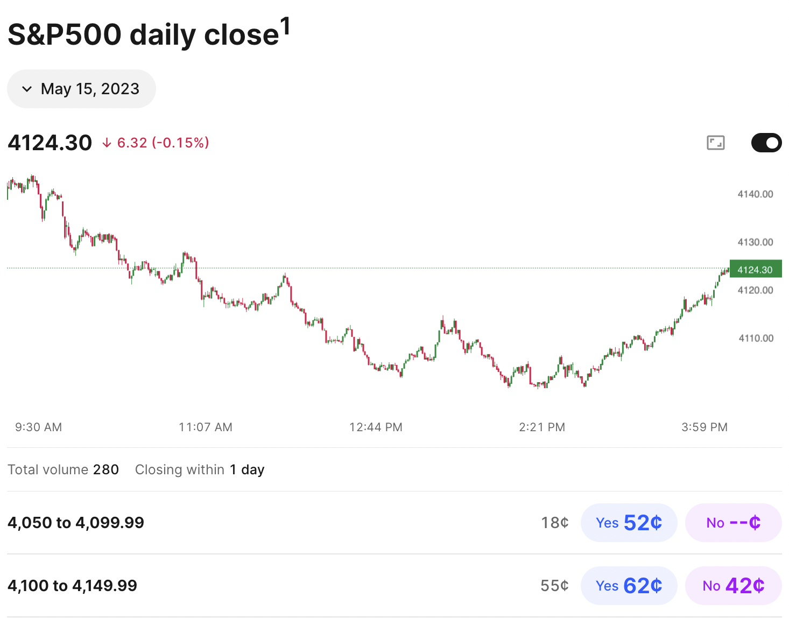
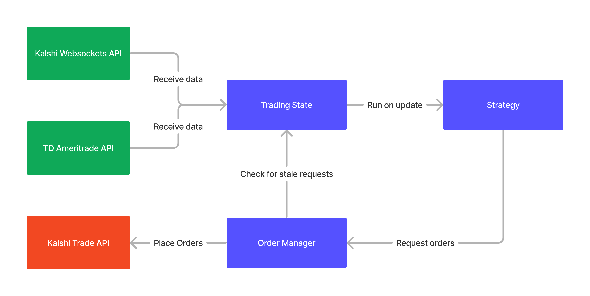
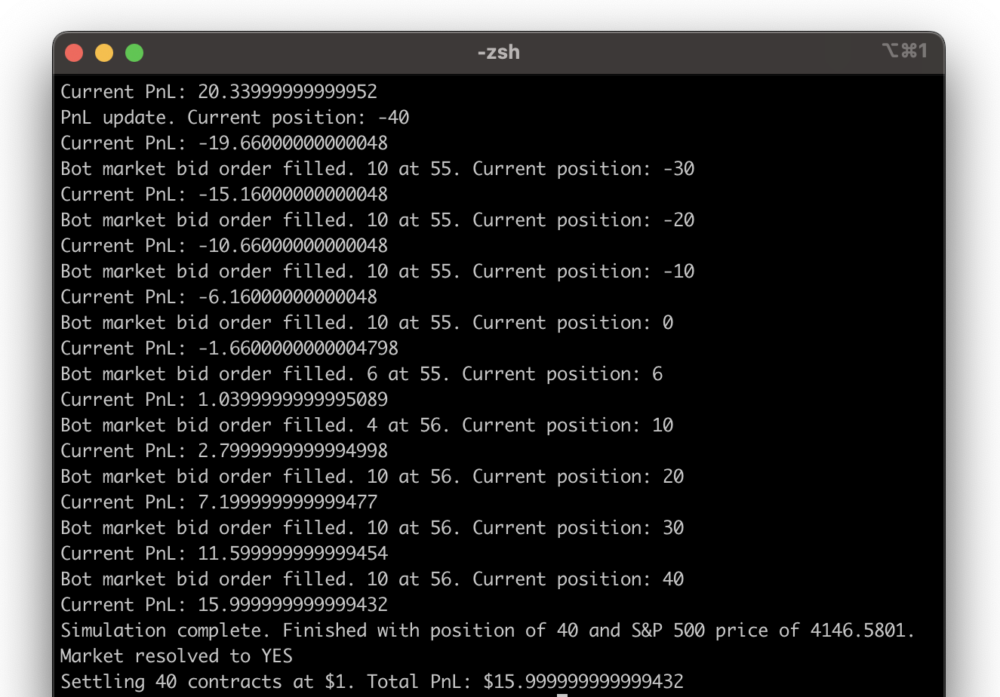

# Kalshi Market Making

Project manager: Nikhil Deorkar

Team members: Simon Lewis, Sid Srikanth, Wendy Cao, Tristan Ma, Elizabeth Ferenick, Trevor Cheng

This repository contains all of the code and data for our Kalshi Market Making project. The project was completed in Spring 2023 for [QuantSC](https://quantsc.org/) at the University of Southern California.

## Project Overview

The goal of this project was to develop and implement a strategy for market making event contracts on [Kalshi](https://kalshi.com). Event contracts are swaps whose payout is dictated by discrete event occurrences or data releases. As such, they allow traders to make predictions about the likelihood of certain events occuring. For our project, we sought to trade on the S&P 500 daily close price market. 

## Trading System

In order to trade autonomously, we built an end-to-end trading system using the Kalshi Websockets API, Kalshi Trade API, and the TD Ameritrade API (for live S&P 500 prices). The main components of the system were: 
- Clients: clients for the Kalshi and TD Ameritrade APIs
- Trading State: store current Kalshi order book, S&P 500 price, and position
- Strategy: compute desired orders based on trading state
- Order Manager: cancel existing orders and place new orders from the strategy

An overview of the components and their interactions is summarized in the image below. 

The code for the trading system can be found in the [market_bot](market_bot) directory. The system was deployed on an AWS EC2 instance to run continuously during the trading day. 

## Strategy

Our strategy had three steps: 
1. Estimate the probability of the S&P 500 closing within a certain price band given the current price of the S&P and the amount of time left in the tradingd day. 
2. Set a spread around the estimate obtained. 
3. Adjust the spread to control inventory. 

To estimate the probability in Step 1, we modeled the daily returns of the S&P with a Cauchy distribution. The Cauchy distribution was chosen due to its fat tails and stability. The parameters of the distribution were found using a maximum likelihood estimate on historical data. Analysis of our estimation method can be found in [strategy_analysis/cauchy_norm.ipynb](strategy_analysis/cauchy_norm.ipynb). 

After finding the probability, we set a symmetric spread around our estimate. Finally, since we desired to hold no inventory, we adjusted the spread up or down depending on whether we held a negative or positive inventory balance. In particular, the spread adjustment size was scaled linearly with the amount of inventory held. 

## Simulation

Currently, there does not exist a backtesting platform for trading on Kalshi. Therefore, to test our strategy, we built a framework that allowed us to simulate trading on historical data. The framework can be found in the [simulation](simulation) directory. The simulator works by interleaving orders from our strategy with historical trading data. This data was collected using the Kalshi and TD Ameritrade clients from our trading system, and was stored in a PostgreSQL database. An example output from the simulator is shown below:  

It's important to note that the simulator does not consider the impact of bot orders on other traders. Additionally, it does not simulate latency between the trading system and the exchange. Despite these limitations, the simulator still served as a valuable tool for experimenting with different strategies and parameters.

## Results

The trading system was run for one continuous day of trading on Kalshi. The strategy was restricted to only place resting orders (no market orders), and to a position limit of 40 contracts. In total, we achieved a $6.80 profit on a $33.40 initial investment (20.3%). The strategy executed 51 trades during the day for a cumulative volume traded of $199.11. 

With a sample size of 1, these results are clearly not intended to show we had a perfect strategy. Rather, it shows that our trading system was able to run uninterrupted while placing, cancelling, and executing trades as intended. In summary, the major accomplishments of this project were: 
1. Development: Built an end-to-end trading system to retrieve live order book data, compute positions, and manage orders. 
2. Strategy: Developed a model to price the probability of S&P 500 daily returns. 
3. Simulation: Collected data and built a simulation engine to test order book strategies on Kalshi.

## Contact

If you have any questions, feel free to reach out to [deorkar@usc.edu](mailto:deorkar@usc.edu). Thank you!